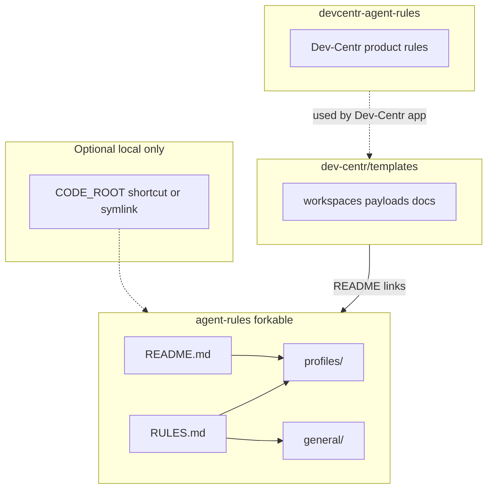

# Architecture: agent rules vs templates vs Dev-Centr product rules

- **agent-rules**: forkable end-user rules.
- **devcentr-agent-rules** (this repo): product rules when Dev-Centr acts for the user.
- **templates**: project templates; links to agent-rules for user-facing rules.
