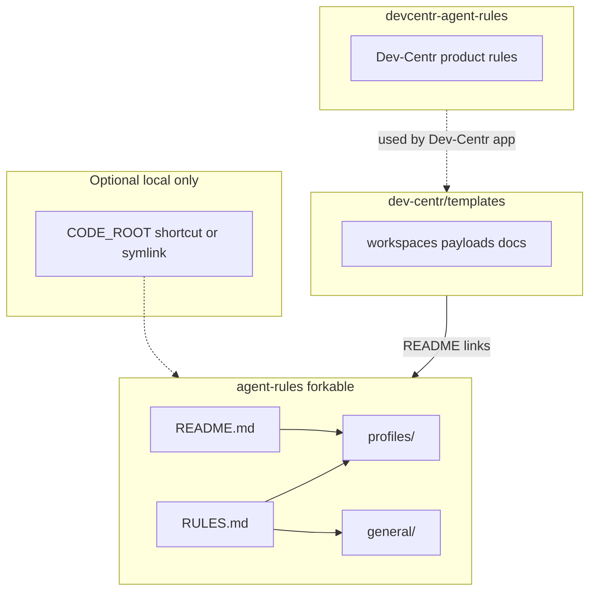

# Dev-Centr agent rules (product)

This repository holds **agent-facing rules used by Dev-Centr when it acts on behalf of the user** (template sync, init flows, workspace application, and similar automation).

It is **not** the forkable end-user rules repository. Developers who want personal, portable rules should use [dev-centr/agent-rules](https://github.com/dev-centr/agent-rules) (generic) or fork [AMDphreak/agent-rules](https://github.com/AMDphreak/agent-rules) (example personal fork).

## Architecture

- **agent-rules**: forkable end-user rules (not this repo).
- **devcentr-agent-rules** (here): product rules when Dev-Centr acts for the user.
- **templates**: project templates; links to agent-rules for user-facing rules.

## Contents

- `RULES.md` — rules text the **product** should load when driving automation for the user. Features a **1-step assembly preamble** to ensure the agent resolves its context and absolute paths correctly from the local code hive. 

## Relation to templates

[dev-centr/templates](https://github.com/dev-centr/templates) provides project templates. Dev-Centr reads **this** repository for product-specific agent behavior, not the forkable `agent-rules` repo.
