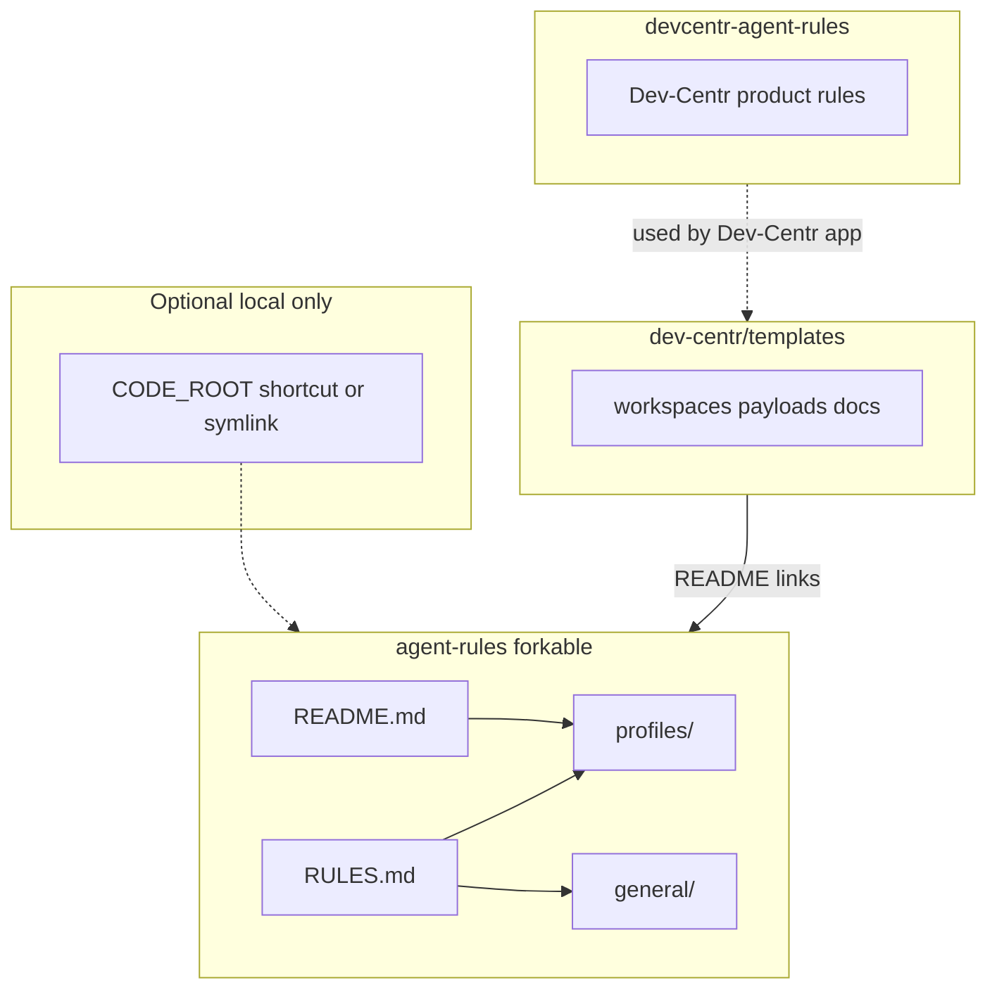

  
  
  
  

  <h3 align="center">Dev-Centr agent rules (product)</h3>

  

    Rules for Dev-Centr product automation acting on behalf of the user, featuring 1-step assembly.
     
     
    <a href="https://github.com/dev-centr/devcentr-agent-rules/issues">Report Bug</a>
    &middot;
    <a href="https://github.com/dev-centr/devcentr-agent-rules/issues">Request Feature</a>
  

  
Table of Contents

  <ol>
    <li><a href="#about-the-project">About The Project</a></li>
    <li><a href="#built-with">Built With</a></li>
    <li><a href="#usage">Usage</a></li>
    <li><a href="#contributing">Contributing</a></li>
    <li><a href="#contact">Contact</a></li>
  </ol>

## About The Project

This repository holds **agent-facing rules used by Dev-Centr when it acts on behalf of the user** (template sync, init flows, workspace application, and similar automation).

It is **not** the forkable end-user rules repository. Developers who want personal, portable rules should use [dev-centr/agent-rules](https://github.com/dev-centr/agent-rules) (generic) or fork [AMDphreak/agent-rules](https://github.com/AMDphreak/agent-rules) (example personal fork).

### Architecture

```mermaid
flowchart TB
  subgraph forkable [agent-rules forkable]
    G[general/]
    P[profiles/]
    R[RULES.md]
    M[README.md]
  end
  subgraph product [devcentr-agent-rules]
    X[Dev-Centr product rules]
  end
  subgraph personal [Optional local only]
    Z[CODE_ROOT shortcut or symlink]
  end
  subgraph other [dev-centr/templates]
    W[workspaces payloads docs]
  end
  M --> P
  R --> P
  R --> G
  Z -.-> forkable
  other -->|README links| forkable
  product -.->|used by Dev-Centr app| other
```

- **agent-rules**: forkable end-user rules (not this repo).
- **devcentr-agent-rules** (here): product rules when Dev-Centr acts for the user.
- **templates**: project templates; links to agent-rules for user-facing rules.

(<a href="#readme-top">back to top</a>)

## Built With

* **Content** — Markdown rules and assembly preamble (`RULES.md`)

(<a href="#readme-top">back to top</a>)

## Usage

### Contents

- `RULES.md` — rules text the **product** should load when driving automation for the user. Features a **1-step assembly preamble** to ensure the agent resolves its context and absolute paths correctly from the local code hive.

### Relation to templates

[dev-centr/templates](https://github.com/dev-centr/templates) provides project templates. Dev-Centr reads **this** repository for product-specific agent behavior, not the forkable `agent-rules` repo.

(<a href="#readme-top">back to top</a>)

## Contributing

Contributions are welcome. Open an issue to discuss larger changes before submitting a pull request.

### Top contributors

(<a href="#readme-top">back to top</a>)

## Contact

DevCentr.org — support@devcentr.org

Project Link: https://github.com/dev-centr/devcentr-agent-rules

Site: https://devcentr.org

(<a href="#readme-top">back to top</a>)

